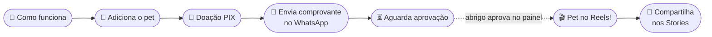

<div align="center">


# AuAu Abrigo 🐾

**Mostre seu pet pra todo mundo — e ajude o abrigo a cuidar de mais patinhas.**

App web mobile-first feito para o **[Abrigo Toca de Assis](https://www.instagram.com/abrigotocadeassisivaipora/)**, ONG de proteção animal de Ivaiporã - PR.

<br />


</div>

---

## 💡 A ideia

O tutor publica o seu bichinho (cachorro, gato ou qualquer pet) com foto e curiosidades. Pra ele aparecer no **feed estilo Reels**, faz uma doação pro abrigo e manda o comprovante no WhatsApp. A equipe confere e aprova — pronto, o pet entra no feed e todo mundo ajuda o abrigo junto. 💛



## ✨ O que tem

| | |
| --- | --- |
| 🎬 **Feed Reels** | Rolagem vertical em tela cheia, curtida com toque duplo, coraçõezinhos e link direto pra cada pet |
| 📸 **Cadastro do pet** | Foto (toque ou arrasta-e-solta), nome, idade, comida exótica favorita, como foi adotado, brincadeira favorita |
| 💸 **Doação via PIX** | R$ 5, 10, 25 ou outro valor — QR Code e copia-e-cola gerados na hora com `pix-utils` |
| 💬 **Comprovante no WhatsApp** | Mensagem já preenchida com o valor e o nome do pet |
| 📲 **Compartilhar** | Folha de compartilhamento nativa do celular (Stories, WhatsApp…) com a foto do pet |
| 🏠 **Conheça o abrigo** | Missão, outras formas de ajudar e link pro Instagram |
| 🛡️ **Painel do abrigo** | Aprovar, ocultar e remover pets, com "Desfazer" — cards no celular, tabela no desktop |
| 🎨 **Capricho visual** | Estilo "desenhado à mão", botões com mola, entradas em cascata, confete no final — e respeita quem pede menos movimento |

## 🚀 Rodando

Precisa do **[Bun](https://bun.sh) 1.3+**.

```bash
bun install
cp .env.example .env   # preencha a chave PIX e o login do painel
bun run dev            # sobe a API (3001) e o Vite (5173) juntos
```

Abre em **http://localhost:5173** — o Vite encaminha `/api` e `/uploads` pra API. Na primeira vez, o banco é criado em `data/` com 3 pets de exemplo. Pro painel, vá em `/admin/login` com o `ADMIN_EMAIL` / `ADMIN_PASSWORD` do `.env`.

```bash
bun run build   # confere os tipos (front + server) e gera dist/
bun run start   # produção: um processo só serve o front e a API
```

## ⚙️ Configuração (`.env`)

| Variável | Pra que serve |
| --- | --- |
| `VITE_PIX_KEY` | Chave PIX **do abrigo** (telefone `+55DDDNUMERO`, e-mail, CPF/CNPJ ou aleatória). **Vazia** = o app esconde o QR e orienta a doar pelo WhatsApp |
| `VITE_PIX_MERCHANT_NAME` | Nome do recebedor no PIX (até 25 caracteres, sem acento) |
| `VITE_PIX_MERCHANT_CITY` | Cidade do recebedor (até 15 caracteres, sem acento) |
| `ADMIN_EMAIL` / `ADMIN_PASSWORD` | Login do painel do abrigo (senha com 8+ caracteres). **Vazio** = painel fechado |
| `PORT` | Porta do servidor em produção (Railway/Fly definem sozinhos). Em dev a API fica na 3001 |
| `DATA_DIR` | Pasta do banco e das fotos (padrão `data/`) |
| `TRUST_PROXY` | `true` atrás de proxy, pra limitar tentativas de login pelo IP real (`X-Forwarded-For`) |

> [!WARNING]
> Só as variáveis com prefixo `VITE_` vão pro navegador — e **qualquer pessoa consegue ler**. Nunca coloque senha ou token com esse prefixo.

> [!NOTE]
> O Vite e a API só leem o `.env` quando iniciam — depois de mudar, reinicie o `bun run dev`.

## 🗄️ Backend

API em **Bun + [Elysia](https://elysiajs.com)**, banco **SQLite** (`bun:sqlite`, sem dependência nativa) em `server/`.

| Decisão | Por quê |
| --- | --- |
| **Fotos em disco** (`data/uploads/<uuid>.jpg`), servidas pelo próprio servidor | Simples e barato. O banco guarda só o nome do arquivo; nome UUID = cache "eterno" no navegador. Trocar por um bucket (R2/S3) é mexer só em `server/storage.ts` |
| **Foto reduzida no celular** antes de subir (máx. 1080×1920, JPEG) | Foto de 3–10 MB vira ~300 KB: upload rápido no 4G e feed leve. O servidor ainda trava em 5 MB e confere o conteúdo real do arquivo (JPG/PNG/WebP) |
| **Tudo que persiste mora em `data/`** | Um volume só pra montar no servidor e fazer backup |
| **Login único do abrigo** no `.env`, sessão em cookie `httpOnly` | Sem tabela de usuários pra manter. O JavaScript da página nunca vê o token; 5 erros por IP = 15 min de espera |
| **API pública não expõe** telefone do tutor nem valor doado | Só o painel (`/api/admin/*`) vê esses dados |
| **Token de edição** devolvido no cadastro | Só quem cadastrou o pet informa o valor da doação |
| **Curtidas anônimas** | O aparelho lembra o que já curtiu; o servidor só soma |

### Rotas

| Rota | O que faz |
| --- | --- |
| `GET /api/pets` · `GET /api/pets/:id` | Feed público (só aprovados) |
| `POST /api/pets` | Cadastro (multipart com `photo`) → devolve o pet + `editToken` |
| `PUT /api/pets/:id/donation` | Valor escolhido (header `X-Edit-Token`, só enquanto pendente) |
| `POST /api/pets/:id/like` | `{ liked: true \| false }` |
| `POST /api/admin/login` · `logout` · `GET /api/admin/me` | Sessão do painel |
| `GET /api/admin/pets` · `PATCH`/`DELETE /api/admin/pets/:id` | Listar, mudar status, remover (apaga a foto junto) |
| `GET /uploads/:arquivo` | Fotos |

### Deploy na VPS (PM2 + Caddy)

Precisa de um lugar com **disco persistente** — aqui, uma VPS. (A Vercel não serve: o disco é apagado a cada deploy.) Na VPS: **Bun**, **Node + PM2** (`npm i -g pm2`) e **Caddy** (HTTPS automático).

**DNS** — no painel do domínio, aponte o subdomínio pro IP da VPS (`A auau → IP`, ou `A * → IP` pra todos os projetos).

**Primeira vez:**

```bash
git clone https://github.com/Jobisss/auau-abrigo.git && cd auau-abrigo
cp .env.example .env && nano .env   # PIX + ADMIN_EMAIL/ADMIN_PASSWORD
bun install && bun run build        # o .env precisa existir antes: VITE_PIX_* entra no front
pm2 start ecosystem.config.cjs      # sobe na porta 3000 (ver ecosystem.config.cjs)
pm2 save && pm2 startup             # volta sozinho se a VPS reiniciar — rode o comando que ele imprimir
```

Cole o bloco de [`deploy/Caddyfile`](deploy/Caddyfile) no `/etc/caddy/Caddyfile` (trocando o subdomínio) e `sudo systemctl reload caddy`.

**Atualizar:**

```bash
git pull && bun install && bun run build && pm2 reload auau-abrigo
```

**Backup** — [`deploy/backup.sh`](deploy/backup.sh) copia o banco (com o app rodando) + as fotos e guarda os últimos 14. No `crontab -e`:

```
0 3 * * * /caminho/auau-abrigo/deploy/backup.sh >> ~/backup-auau.log 2>&1
```

> [!TIP]
> Backup no mesmo disco da VPS não salva de disco queimado — de vez em quando baixe um `.tar.gz` pro seu PC (`scp`).

**Útil:** `pm2 logs auau-abrigo` · `pm2 monit` · `pm2 restart auau-abrigo`

Em produção os pets de exemplo **não** são criados, e `data/` nunca é tocada pelo `git pull`.

## 🗺️ Telas

| Rota | Tela |
| --- | --- |
| `/` | Como funciona (passo a passo) |
| `/adicionar` | Adicione o seu pet |
| `/doacao` | Escolha do valor + PIX |
| `/enviar-comprovante` | Redireciona pro WhatsApp |
| `/obrigado` | Aguardando aprovação 🎉 |
| `/reels` | Feed de pets aprovados (`?pet=<id>` abre direto num pet) |
| `/compartilhar/:id` | Compartilhar o pet nos Stories |
| `/abrigo` | Conheça o abrigo |
| `/admin/login` → `/admin` | Painel de aprovação |

## 🧱 Estrutura

```
deploy/
├── Caddyfile             # bloco do proxy reverso com HTTPS
└── backup.sh             # backup diário de data/ (cron)
ecosystem.config.cjs      # PM2 na VPS
server/
├── index.ts              # rotas (Elysia) + fotos + front em produção
├── db.ts                 # SQLite: schema, formato público/admin, pets de exemplo
├── storage.ts            # onde as fotos ficam (disco) — trocar aqui pra usar bucket
├── auth.ts               # login do painel, sessão, limite de tentativas
├── config.ts             # variáveis de ambiente e pastas
└── seed/                 # fotos dos pets de exemplo
src/
├── App.tsx               # rotas
├── main.tsx
├── styles.css            # tokens (cores, sombras, motion) + componentes base
├── screens.css           # estilos e animações de cada tela
├── components/ui.tsx     # header, menu de suporte, toast, modal, confete, count-up…
├── data/mock.ts          # dados do abrigo e tipos
├── lib/api.ts            # cliente da API
├── lib/image.ts          # reduz a foto antes do upload
├── lib/pix.ts            # geração do PIX (BR Code + QR)
├── state/AppState.tsx    # estado global (feed, pet recém-cadastrado, sessão do painel)
└── screens/
    ├── HowItWorks.tsx  AddPet.tsx  Donation.tsx  SendReceipt.tsx  Thanks.tsx
    ├── Reels.tsx  SharePreview.tsx  Shelter.tsx
    └── admin/  AdminLogin.tsx  AdminDashboard.tsx
```

## 🎨 Paleta

| | Cor | Uso |
| --- | --- | --- |
|  | `#1A2B4A` | Tinta: contornos, sombras e textos |
|  | `#2364AA` | Azul: botões principais e títulos |
|  | `#FEC601` | Amarelo: ações secundárias e destaques |
|  | `#73BFB8` | Verde-água: cards de info e sucesso |
|  | `#EA7317` | Laranja: avisos e pendências |
|  | `#FFF9F0` | Creme: fundo |

Fontes: **Balsamiq Sans** (texto) e **Just Me Again Down Here** (títulos à mão).

## 🛣️ Próximos passos

- [x] Backend: salvar pets, fotos e aprovações de verdade
- [x] Login real pro painel do abrigo
- [x] Chave PIX oficial do abrigo no `.env`
- [ ] Deploy com volume persistente e backup de `data/`
- [ ] Limpar pets pendentes abandonados (cadastrou e nunca doou)
- [ ] Upload de comprovante direto no app

## 💛 Ajude o abrigo

Mesmo sem o app: o **Abrigo Toca de Assis** recebe ração e produtos de limpeza em pontos de coleta em Ivaiporã. Siga e ajude em **[@abrigotocadeassisivaipora](https://www.instagram.com/abrigotocadeassisivaipora/)**.

<div align="center">
<br />
Feito com 🐾 para quem só precisa de um lar.
</div>
